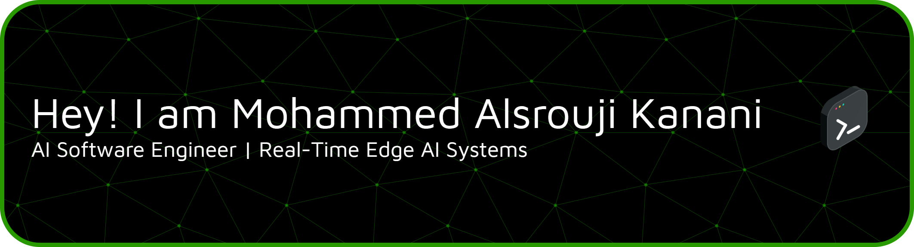
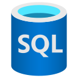

<div align="center" style="pointer-events: none; cursor: default;">
  
</div>

<br/>

<div align="center" style="pointer-events: none; cursor: default;">
  
</div>

<br/>

---

## 🧠 About Me

I'm an **AI Software Engineer** focused on building **real-time intelligent systems** — working the full pipeline from raw data to production-grade deployment.

```
Data Processing  →  Model Training  →  Evaluation  →  Deployment
```

**4+ years** designing and shipping AI systems that run fast, scale well, and solve real problems.

---

## 🚀 What I Build

| Domain | Focus |
|---|---|
| 🤖 **Fullstack AI** | End-to-end pipelines covering data ingestion, model integration, API, deployment |
| ⚡ **Edge AI** | Optimized inference on embedded devices, mobile platforms, and resource-constrained hardware  |
| 🔬 **Research & Development** | Rapid prototyping, benchmarking, and evaluation of modern ML models |
| 🕹️ **Real-Time Intelligent Systems** | Low-latency inference at scale |
| 📊 **LLM-Powered Data Analysis** | Applications that transform documents, logs, and other unstructured data into searchable, structured, and actionable insights |
| 🗂️ **RAG Systems** | Retrieval-augmented generation pipelines end-to-end |

---

## 🛠️ Tech Stack

### 🤖 AI / ML

<p align="left">
  <a title="Python" style="pointer-events: none; cursor: default;">
    &nbsp;&nbsp;
  </a>
  <a title="TensorFlow" style="pointer-events: none; cursor: default;">
    &nbsp;&nbsp;
  </a>
  <a title="PyTorch" style="pointer-events: none; cursor: default;">
    &nbsp;&nbsp;
  </a>
  <a title="LangChain" style="pointer-events: none; cursor: default;">
    &nbsp;&nbsp;
  </a>
  <a  title="Hugging Face" style="pointer-events: none; cursor: default;">
    &nbsp;&nbsp;
  </a>
  <a title="Streamlit" style="pointer-events: none; cursor: default;">
    
  </a>
</p>

### ⚡ Edge AI

<p align="left">
  <a title="TFLite" style="pointer-events: none; cursor: default;">
    &nbsp;&nbsp;
  </a>
  <a title="ONNX" style="pointer-events: none; cursor: default;">
    &nbsp;&nbsp;
  </a>
  <a  title="OpenVINO" style="pointer-events: none; cursor: default;">
    
  </a>
</p>

### 🗄️ Databases

<p align="left">
  <a title="SQL" style="pointer-events: none; cursor: default;">
    &nbsp;&nbsp;
  </a>
  <a title="ChromaDB" style="pointer-events: none; cursor: default;">
    &nbsp;&nbsp;
  </a>
  <a title="Neo4j" style="pointer-events: none; cursor: default;">
    &nbsp;&nbsp;
  </a>
</p>

### 🔧 DevOps & Tools

<p align="left">
  <a title="Docker" style="pointer-events: none; cursor: default;">
    &nbsp;&nbsp;
  </a>
  <a title="Azure" style="pointer-events: none; cursor: default;">
    &nbsp;&nbsp;
  </a>
  <a title="Git" style="pointer-events: none; cursor: default;">
    &nbsp;&nbsp;
  </a>
  <a title="Jira" style="pointer-events: none; cursor: default;">
    
  </a>
</p>

---

## 📫 Let's Connect

<p align="left">
  <a href="https://www.linkedin.com/in/mohammedalsrouji/" target="_blank" title="LinkedIn">
    &nbsp;&nbsp;
  </a>
  <a href="mailto:mhdsq8@gmail.com" title="Gmail">
    
  </a>
</p>

---

## 💼 Open to Work

> 🌍 **Available for remote positions and freelance projects.**
>
> Have a challenging AI problem? Let's build something intelligent together.

---

<div align="center">
  
</div>
